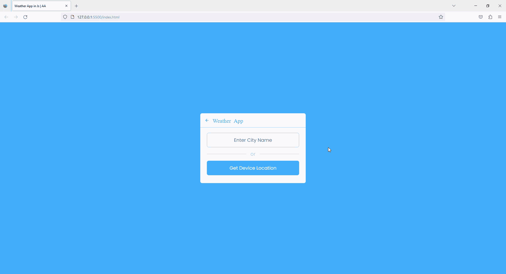

# Weather_App

<section>
		<h1>Features</h1>
		<ul>
			<li>Users can search for a location by name or ZIP code to view the current weather and forecast for the next 15 days.</li>
			<li>The current weather conditions include temperature, humidity, wind speed, and a description of the weather conditions.</li>
			<li>The forecast includes the high and low temperatures for each of the next 15 days.</li>
		</ul>
	</section>
	</section>
<h2>Technologies Used</h2>
		<ul>
			<li>HTML</li>
			<li>CSS</li>
			<li>JavaScript</li>
			<li>OpenWeather API</li>
		</ul>
<section>
		<h2>Future Improvements</h2>
		<ul>
			<li>Allow users to toggle between Celsius and Fahrenheit for temperature units.</li>
			<li>Add more detailed weather information, such as UV index and air quality.</li>
			<li>Improve the design and user interface of the app.</li>
			<li>Allow users to save their favorite locations and view their weather information quickly.</li>
		</ul>
	<h2>License</h2>
	
This project is licensed under the MIT License. See the <a href="LICENSE">LICENSE</a> file for details.

 
